# Responsible AI Toolkit

A practical collection of tools, policies, and checklists to help teams build AI systems responsibly. Born from real-world experience implementing responsible AI practices across different organizations.

## 🏗️ What's Inside

```mermaid
graph TD
    A[🧰 RAI Toolkit] --> B[🔧 Security Tools]
    A --> C[📋 Policies & Templates]
    A --> D[⚡ Automation & CI]
    
    B --> B1[🔍 PII Scanner]
    B --> B2[⚖️ Bias Auditor]
    B --> B3[🛡️ Toxicity Evaluator]
    B --> B4[🔒 Prompt Injection Scanner]
    
    C --> C1[📝 AI Use Policy]
    C --> C2[🚀 Model Release Policy]
    C --> C3[📊 Data Governance]
    C --> C4[🚨 Incident Response]
    C --> C5[📄 Model/Data Card Templates]
    
    D --> D1[✅ Pre-commit Hooks]
    D --> D2[🤖 GitHub Actions]
    D --> D3[📋 PR/Deployment Checklists]
    D --> D4[🧪 Evaluation Runner]
    
    style A fill:#4CAF50,stroke:#2E7D32,color:#fff
    style B fill:#2196F3,stroke:#1565C0,color:#fff
    style C fill:#FF9800,stroke:#E65100,color:#fff
    style D fill:#9C27B0,stroke:#6A1B9A,color:#fff
```



This toolkit gives you the building blocks that teams actually need:

- **Working security scanners** for PII, secrets, and prompt injection attacks
- **Bias detection tools** that catch unfair dataset distributions  
- **Ready-to-use policies** for AI governance, incident response, and model releases
- **Documentation templates** that pass compliance audits
- **CI/CD examples** that integrate with your existing workflows

## Why Another RAI Toolkit?

Most responsible AI resources are either too academic or too vendor-specific. We built this because:

- Teams kept rebuilding the same basic scanners and policies
- Existing tools didn't integrate well with normal development workflows  
- Documentation was either missing or overly complex
- Nobody had good examples of what "responsible AI in production" actually looks like

## Key Features

**Security & Privacy**
- PII scanner with common patterns (emails, SSNs, phone numbers)
- Secrets detection integrated with pre-commit hooks
- Prompt injection pattern matching

**Fairness & Bias**  
- Dataset bias auditing for protected attributes
- Model evaluation harnesses for systematic testing
- Bias reporting templates

**Governance & Compliance**
- Model and data card generators
- Risk assessment templates
- Incident response playbooks
- Policy templates you can actually customize

## Getting Started

### 🚀 Quick Setup
```bash
python3 -m venv rai-toolkit && source rai-toolkit/bin/activate
pip install -r requirements.txt
pre-commit install
pytest -q
```

### 🧭 Find Your Path
- **New to RAI?** → Start with [QUICK_START.md](QUICK_START.md) for role-based guidance
- **Need specific tools?** → Use [NAVIGATOR.md](NAVIGATOR.md) to find what you need  
- **Enterprise deployment?** → Follow [SETUP.md](SETUP.md) for Docker & production setup
- **Integration help?** → Check [INTEGRATIONS.md](INTEGRATIONS.md) for CI/CD examples

### 📋 Key Resources
- **Templates:** [Model cards, risk registers, and more](templates/README.md)
- **Checklists:** [PR reviews and deployment safety](checklists/)
- **Policies:** [Governance and incident response](policies/)
- **Examples:** [Real-world usage samples](examples/)

## Best Practices for Organizations

- Integrate checklists into deployment and review pipelines.
- Use evaluation scripts as part of model validation and monitoring.
- Customize governance templates for your regulatory and risk context.
- Document models and datasets using provided templates.

## Contributing

See [CONTRIBUTING.md](CONTRIBUTING.md) and the [PR RAI Checklist](checklists/pr_rai_checklist.md).

## License
[MIT](LICENSE)

